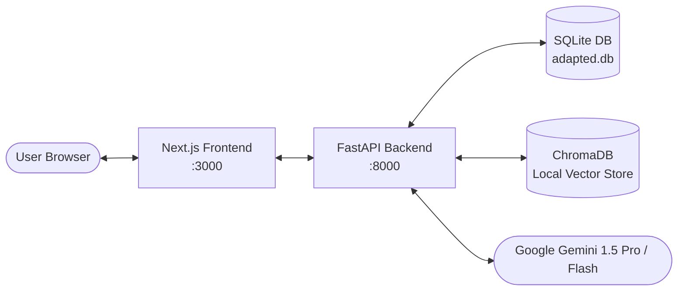

# 🧪 AdaptED AI — Page-by-Page Complete Testing & Verification Guide

> **Target Audience:** Developers, QA Testers, Hackathon Judges, and Reviewers.  
> **Platform Stack:** Next.js 14 (App Router) Frontend + FastAPI Backend + SQLite (User & Learning State) + ChromaDB (Local RAG Vector DB) + Google Gemini AI.

---

## 📑 Table of Contents

1. [Platform Architecture & Prerequisites](#-1-platform-architecture--prerequisites)
2. [Starting the Development Servers](#-2-starting-the-development-servers)
3. [Page-by-Page Testing Walkthrough](#-3-page-by-page-testing-walkthrough)
   - [Page 1: Landing Page (`/`)](#page-1-landing-page-)
   - [Page 2: Account Registration (`/signup`)](#page-2-account-registration-signup)
   - [Page 3: Account Sign In (`/login`)](#page-3-account-sign-in-login)
   - [Page 4: Goal-Oriented Onboarding (`/onboarding`)](#page-4-goal-oriented-onboarding-onboarding)
   - [Page 5: Student Analytics Dashboard (`/dashboard`)](#page-5-student-analytics-dashboard-dashboard)
   - [Page 6: Study Materials & Local Vector RAG (`/materials`)](#page-6-study-materials--local-vector-rag-materials)
   - [Page 7: Smart Document Summarizer Modal (`/materials`)](#page-7-smart-document-summarizer-modal-materials)
   - [Page 8: Adaptive AI Tutor (`/assistant`)](#page-8-adaptive-ai-tutor-assistant)
   - [Page 9: Adaptive Practice Quiz Engine (`/practice`)](#page-9-adaptive-practice-quiz-engine-practice)
   - [Page 10: Coding Challenges & Weak-Topic Lab (`/practice?tab=challenge`)](#page-10-coding-challenges--weak-topic-lab-practicetabchallenge)
   - [Page 11: Dynamic Learning Path & Roadmap (`/path`)](#page-11-dynamic-learning-path--roadmap-path)
   - [Page 12: Student Profile & Parent Sync Key (`/profile`)](#page-12-student-profile--parent-sync-key-profile)
   - [Page 13: Parent Sync Portal & AI Parent Advisor (`/parent-dashboard`)](#page-13-parent-sync-portal--ai-parent-advisor-parent-dashboard)
4. [End-to-End Golden Happy Path (10-Minute Demo Script)](#-4-end-to-end-golden-happy-path-10-minute-demo-script)
5. [Troubleshooting & Sanity Checks](#-5-troubleshooting--sanity-checks)
6. [Complete QA Feature Checklist Matrix](#-6-complete-qa-feature-checklist-matrix)

---

## ⚙️ 1. Platform Architecture & Prerequisites

Before beginning tests, ensure the environment satisfies these requirements:

- **Node.js**: `v18.x` or `v20.x`
- **Python**: `3.10` to `3.12`
- **Gemini API Key**: Set in `backend/.env` as `GEMINI_API_KEY=AIzaSy...`
- **Browser**: Modern Chromium browser (Google Chrome, Microsoft Edge, or Brave) for Speech Recognition and Text-to-Speech support.



---

## 🚀 2. Starting the Development Servers

Open two separate terminal windows in your project directory:

### 🖥️ Terminal 1: Backend (FastAPI)
```powershell
# From project root: D:\AI-Projects\AdaptED AI
cd "D:\AI-Projects\AdaptED AI\backend"

# Activate Python Virtual Environment
.\venv\Scripts\activate

# Launch API server with hot-reload
uvicorn app.main:app --reload --port 8000
```
- **Backend Health Check:** `http://localhost:8000/health` (Returns `{"status":"ok", ...}`)
- **Interactive Swagger Documentation:** `http://localhost:8000/docs`

---

### 🌐 Terminal 2: Frontend (Next.js)
```powershell
# From project root: D:\AI-Projects\AdaptED AI
cd "D:\AI-Projects\AdaptED AI\frontend"

# Launch Next.js dev server
npm run dev
```
- **Web App URL:** `http://localhost:3000`

---

## 🔍 3. Page-by-Page Testing Walkthrough

---

### Page 1: Landing Page (`/`)
**URL:** `http://localhost:3000/`  
**Route File:** `frontend/src/app/page.tsx`

#### Objective:
Verify introductory brand messaging, responsive hero section, navigation links, and automatic authentication redirection.

#### Verification Steps:
1. Open an incognito browser window and navigate to `http://localhost:3000/`.
2. **Hero Section Verification:**
   - Verify the main headline reads: *"Not a fixed study plan. A journey that adapts to you."*
   - Verify the pill badge: *"Intelligent Adaptive Learning Platform"*.
   - Verify the 3 feature highlight cards:
     - 🧠 **Dynamic Mastery Model** (EMA algorithm explanation).
     - 📖 **Document RAG Engine** (Local PDF grounding).
     - 🎯 **Continuous Adaptation** (Adaptive path & quizzes).
3. **CTA Buttons Check:**
   - Click the top-nav **"Log In"** button ➔ Redirects to `/login`.
   - Return to `/` and click **"Get Started"** or **"Start Learning Now"** ➔ Redirects to `/signup`.
4. **Session Persistence Redirection:**
   - Once logged in, navigating back to `/` must automatically redirect you directly to `/dashboard`.

---

### Page 2: Account Registration (`/signup`)
**URL:** `http://localhost:3000/signup`  
**Route File:** `frontend/src/app/(auth)/signup/page.tsx`

#### Objective:
Validate user account creation with role differentiation (**Student** vs. **Parent**), input validation, JWT token storage, and initial redirection.

```
+-----------------------------------------------------------+
|                   Create an account                       |
| Account Type:  [ 🎓 Student ]  [ 👨‍👩‍👧 Parent ]           |
| Name:          [ Riya Sharma                            ] |
| Email:         [ riya@test.com                          ] |
| Password:      [ **********                             ] |
|                                                           |
|                 [ Create Account ]                        |
+-----------------------------------------------------------+
```

#### Test Case 2.1: Student Account Creation
1. Navigate to `http://localhost:3000/signup`.
2. Under **Account Type**, click **"🎓 Student"** (selected by default; highlighted with an active primary border).
3. Fill in the fields:
   - **Name:** `Riya Sharma`
   - **Email:** `student1@test.com` (use a unique email)
   - **Password:** `pass1234`
4. Click **Create Account**.
5. **Expected Result:**
   - Account is saved in `adapted.db` with `role='student'`.
   - JWT access token is stored in `localStorage`.
   - User is redirected immediately to `/onboarding`.

#### Test Case 2.2: Parent Account Creation
1. Open a new Incognito window or log out.
2. Navigate to `http://localhost:3000/signup`.
3. Under **Account Type**, click **"👨‍👩‍👧 Parent"**.
4. Fill in the fields:
   - **Name:** `Rajesh Sharma`
   - **Email:** `parent1@test.com`
   - **Password:** `pass1234`
5. Click **Create Account**.
6. **Expected Result:**
   - Account is saved in `adapted.db` with `role='parent'`.
   - User is redirected directly to `/parent-dashboard`.

#### Test Case 2.3: Duplicate Email Validation
1. Attempt to register again using the same email `student1@test.com`.
2. **Expected Result:**
   - Red error alert appears: *"Email already registered"* or *"Signup failed"*.
   - User remains on the signup page.

---

### Page 3: Account Sign In (`/login`)
**URL:** `http://localhost:3000/login`  
**Route File:** `frontend/src/app/(auth)/login/page.tsx`

#### Objective:
Verify login credential verification, error notifications, and role/profile-aware redirect logic.

#### Verification Steps:
1. Navigate to `http://localhost:3000/login`.
2. **Test Case 3.1: Invalid Credentials:**
   - Enter `wrong@email.com` and `invalidpassword`.
   - Click **Login**.
   - **Expected Result:** Red error message appears: *"Invalid email or password"*.
3. **Test Case 3.2: Existing Student Sign In:**
   - Enter `student1@test.com` and `pass1234`.
   - Click **Login**.
   - **Expected Result:**
     - If onboarding was completed ➔ Redirects to `/dashboard`.
     - If onboarding was NOT completed ➔ Redirects to `/onboarding`.
4. **Test Case 3.3: Existing Parent Sign In:**
   - Enter `parent1@test.com` and `pass1234`.
   - Click **Login**.
   - **Expected Result:** Redirects to `/parent-dashboard`.

---

### Page 4: Goal-Oriented Onboarding (`/onboarding`)
**URL:** `http://localhost:3000/onboarding`  
**Route File:** `frontend/src/app/(app)/onboarding/page.tsx`

#### Objective:
Ensure the initial learner profile is established. This data serves as the **"North Star"** context for the Gemini AI tutor, practice questions, and learning path generator.

```
+-----------------------------------------------------------+
|          Welcome! Let's set up your profile               |
| Academic Level:     [ Undergraduate                     ] |
| Subject to Learn:   [ Python                            ] |
| What is your goal?: [ Ace exams & master DSA            ] |
| Experience Level:   [ Beginner                       v  ] |
|                                                           |
|                 [ Start Learning ]                        |
+-----------------------------------------------------------+
```

#### Verification Steps:
1. Log in as a new student and land on `/onboarding`.
2. Fill out the onboarding form:
   - **Academic Level:** Enter `Undergraduate / B.Tech Computer Science`.
   - **Subject to Learn:** Verify it is locked or defaulted to `Python`.
   - **What is your goal?:** Enter `Ace upcoming exams and master Data Structures`.
   - **Experience Level:** Select from dropdown: `Beginner`, `Intermediate`, or `Advanced`.
3. Click **Start Learning**.
4. **Expected Result:**
   - Form button changes to *"Saving..."*.
   - POST request to `/api/profile/onboarding` succeeds.
   - User profile record is initialized with default topic masteries (Variables, Control Flow, Functions, Data Structures, OOP).
   - User is redirected to `/dashboard`.

---

### Page 5: Student Analytics Dashboard (`/dashboard`)
**URL:** `http://localhost:3000/dashboard`  
**Route File:** `frontend/src/app/(app)/dashboard/page.tsx`

#### Objective:
Validate real-time mastery display, streak calculation, weakness diagnostics, and quick-action triggers.

```
+---------------------------------------------------------------------------------+
| Welcome back, Riya Sharma                          [ 📖 Materials ] [ ✏️ Practice ]|
| 🎯 Goal: Ace upcoming exams and master Data Structures                          |
|                                                                                 |
| +------------------------------------+  +-------------------------------------+ |
| | 🏆 Overall Mastery                 |  | 🧠 Stats                            | |
| | 42.5% [ Improving ^ ]             |  | Quizzes Taken: 3                    | |
| | [=================>              ] |  | Day Streak: 1 🔥                    | |
| +------------------------------------+  | PDFs Uploaded: 2                    | |
|                                         +-------------------------------------+ |
| +------------------------------------+  +-------------------------------------+ |
| | Strengths & Weaknesses             |  | Topic Breakdown                     | |
| | Strong Concepts:                   |  | • Variables (85%)   [Code] [Quiz →] | |
| |  [ Syntax ] [ Print statements ]   |  | • Loops (38%)       [Code] [Quiz →] | |
| | Needs Review:                      |  | • Functions (25%)   [Code] [Quiz →] | |
| |  [ Nested loops x ] [ Off-by-one ] |  +-------------------------------------+ |
| +------------------------------------+                                          |
+---------------------------------------------------------------------------------+
```

#### Verification Steps:
1. Inspect the **Header**:
   - Verify greeting contains student's registered name (*"Welcome back, Riya Sharma"*).
   - Verify active goal reflects the onboarding setting.
2. Inspect the **Mastery Card**:
   - Verify the large percentage counter (e.g. `0.0%` for a fresh account, updating with practice).
   - Verify the trend badge (`improving` in green, `declining` in red, or `stable`).
3. Inspect the **Stats Card**:
   - Check **Quizzes Taken** count matches real DB records.
   - Check **Day Streak** shows at least `1 🔥`.
   - Check **PDFs Uploaded** count accurately reflects the material library.
4. Inspect the **Strengths & Weaknesses**:
   - Review concepts in green under **Strong Concepts**.
   - Review weak tags under **Needs Review** (red border).
   - Click on any weak concept tag (e.g., `nested-loops`) ➔ Verify it navigates directly to `/practice?tab=challenge`.
5. Inspect the **Topic Breakdown**:
   - Each topic displays a progress bar color-coded by mastery band:
     - 🟢 **Mastered** (>= 80%)
     - 🔵 **Competent** (>= 60%)
     - 🟡 **Developing** (>= 40%)
     - 🔴 **Novice** (< 40%)
   - Click the **"Code"** button next to any topic ➔ Navigates to `/practice?tab=challenge&topic_id={id}`.
   - Click the **"Quiz →"** button next to any topic ➔ Navigates to `/practice?topic_id={id}`.

---

### Page 6: Study Materials & Local Vector RAG (`/materials`)
**URL:** `http://localhost:3000/materials`  
**Route File:** `frontend/src/app/(app)/materials/page.tsx`

#### Objective:
Verify multi-PDF upload, chunking, local vector embeddings in ChromaDB, data isolation, and material deletion.

```
+---------------------------------------------------------------------------------+
| Course Materials & Knowledge Base                                               |
| Ground your AI tutor and quiz generator in your own course materials.            |
|                                                                                 |
| + - - - - - - - - - - - - - - - - - - - - - - - - - - - - - - - - - - - - - - + |
| |                         📤 Drag & Drop PDFs here                            | |
| |                    or click to browse from your computer                    | |
| |                         [ Choose PDF Files ]                                | |
| + - - - - - - - - - - - - - - - - - - - - - - - - - - - - - - - - - - - - - - + |
|                                                                                 |
| Uploaded Documents (2)                                      Total Chunks: 48    |
| • Python_Basics_Ch1.pdf   | 24 Chunks | 142 KB | [Ready] | [Summarize] [🗑️]   |
| • Loops_and_Lists.pdf     | 24 Chunks | 210 KB | [Ready] | [Summarize] [🗑️]   |
+---------------------------------------------------------------------------------+
```

#### Verification Steps:
1. Navigate to `/materials`.
2. **Test File Upload (Drag & Drop or Button Click):**
   - Click the dropzone or drag 1 or 2 small PDF files (e.g. course lecture notes or Python cheatsheets).
   - *Note: Non-PDF files should display an alert: "Only PDF documents (.pdf) are supported".*
3. **Observe Vector Indexing:**
   - The UI shows a loader: *"Extracting text & generating local vector embeddings..."*.
   - Backend extracts text page-by-page, splits into ~500-token chunks with overlap, and writes embeddings to local ChromaDB.
4. **Inspect Material Table Card:**
   - Document row appears with:
     - Document Name
     - File size in KB/MB
     - Total chunks extracted (e.g., `18 chunks`)
     - Status badge: 🟢 `Ready`
     - Action buttons: **"Summarize"** (Sparkle icon) and **"Delete"** (Trash icon).
5. **Verify Vector Chunk Counter:**
   - In the top right of the list, confirm the **Total Chunks** count updates.
6. **Test Deletion:**
   - Click the trash icon on one PDF.
   - Confirm the deletion prompt.
   - Verify the row disappears and the chunk count decreases.

---

### Page 7: Smart Document Summarizer Modal (`/materials`)
**Trigger:** Click the **"Summarize"** button next to any ready PDF on `/materials`.  
**Component:** Embedded within `frontend/src/app/(app)/materials/page.tsx`.

#### Objective:
Verify multi-modal AI chapter synthesis across 3 distinct pedagogical perspectives.

```
+---------------------------------------------------------------------------------+
| 📋 Smart Document Summarizer: Python_Basics_Ch1.pdf                      [ X ]  |
|                                                                                 |
| Select Mode:                                                                    |
| [ 📖 Comprehensive Breakdown ] [ ⚡ Quick Cheat Sheet ] [ 👶 ELI5 Breakdown ]   |
|                                                                                 |
| +-----------------------------------------------------------------------------+ |
| | ## Core Concept Summary                                                     | |
| | This chapter establishes the fundamentals of variable assignment,           | |
| | data types (int, float, str, bool), and standard input/output...             | |
| |                                                                             | |
| | ### Key Takeaways                                                           | |
| | 1. Python variables are dynamically typed references to objects.             | |
| | 2. Mutable objects (like lists) mutate in-place; tuples are immutable.       | |
| +-----------------------------------------------------------------------------+ |
|                                                                                 |
| [ 📋 Copy Summary ]             [ 🖨️ Print View ]                [ Close ]     |
+---------------------------------------------------------------------------------+
```

#### Verification Steps:
1. In the materials list, click the **"Summarize"** button for an uploaded PDF.
2. The interactive modal opens. Test all 3 summary modes:
   - **Mode A: 📖 Comprehensive Breakdown**
     - Click **Comprehensive**.
     - Verify it delivers structured chapter summaries, section headings, and common student pitfalls.
   - **Mode B: ⚡ Quick Cheat Sheet**
     - Click **Cheat Sheet**.
     - Verify high-yield syntax rules, concise code formulas, and rapid-recall definitions.
   - **Mode C: 👶 ELI5 Breakdown**
     - Click **ELI5 Breakdown**.
     - Verify explanations use simple everyday metaphors (e.g. variables described as labeled shoe boxes) with zero unexplained jargon.
3. **Test Utility Buttons:**
   - Click **"Copy Summary"**: Button text changes to *"Copied!"* with a green checkmark.
   - Click **"Print View"**: Native browser print dialogue opens formatted cleanly without UI chrome.
   - Click **"Close"** or the `X` icon: Modal cleanly dismisses.

---

### Page 8: Adaptive AI Tutor (`/assistant`)
**URL:** `http://localhost:3000/assistant`  
**Route File:** `frontend/src/app/(app)/assistant/page.tsx`

#### Objective:
Test the core interactive learning engine: 6 pedagogical modes, local RAG document citations, Mermaid.js diagram generation, voice speech-to-text/text-to-speech, and chat session history persistence.

```
+-----------------------------------------------------------------------------------------+
| [ 📁 History ] | 🎓 Socratic Guide | 👶 ELI5 | 📝 Exam Prep | 💻 Code-First | 💼 Interview |
|----------------+------------------------------------------------------------------------|
| Past Sessions: | 🤖 AI Assistant (Socratic Guide Mode)                                  |
| • Loops Q&A    |                                                                        |
|   Today (4 msg)| 🧑 Student: Why do we use while loops instead of for loops?           |
| • Recursion    |                                                                        |
|   Yesterday    | 🤖 AI Tutor: Think about when you don't know the exact number of       |
|                |    times something needs to happen beforehand. If you're waiting for   |
| [+ New Chat]   |    a user to type 'quit', how would a for loop count that?             |
|                |                                                                        |
|                | 📄 Cited: Python_Notes.pdf (Page 6)                                    |
|                | [ 🔊 Listen ]                                                          |
|----------------+------------------------------------------------------------------------|
| [ 🎙️ Mic ]  [ Type your question or prompt here...                      ]  [ Send -> ] |
+-----------------------------------------------------------------------------------------+
```

#### Test Case 8.1: 6 Pedagogical Learning Modes
Test each persona button in the top bar with the suggested questions:

| Mode | Test Prompt | Expected AI Behavior |
|---|---|---|
| **Adaptive Tutor** | *"Explain list comprehensions in Python"* | Balanced explanation adapted to student's current mastery band and goal. |
| **Socratic Guide** | *"Why do we use while loops?"* | Does **not** give the answer immediately; asks guiding questions to trigger self-discovery. |
| **ELI5** | *"Explain recursion like I'm 5"* | Uses everyday analogies (like Russian nesting dolls or mirrors reflecting mirrors) without academic jargon. |
| **Exam & Viva Prep** | *"Explain Python decorators"* | Outputs structured 5-mark answer points, clear bullet definitions, and likely viva examiner questions. |
| **Code-First** | *"Show me how custom generators work"* | Leads with runnable code snippets and console outputs first, followed by brief explanations. |
| **Technical Interview** | *"How does a hash map resolve collisions?"* | Analyzes Big-O time/space complexity ($O(1)$ vs $O(N)$), trade-offs, and scalability considerations. |

#### Test Case 8.2: Document Grounding & Citations
1. Ask a question directly covered in your uploaded PDF:
   - Example: *"What does my syllabus say about midterm exam weightage?"* or *"According to my notes, how is a binary search defined?"*
2. **Expected Result:**
   - The response badge shows: *"📄 Source: [Filename.pdf], Page X"*.
   - Answers are factually grounded in the uploaded document rather than generic web hallucinations.

#### Test Case 8.3: Mermaid.js Diagram Generation
1. In the chat box, type:  
   `Please draw a Mermaid flowchart showing the decision logic of a while loop with a break condition.`  
   *(or click the suggestion chip "Draw Concept Flowchart" if visible)*.
2. **Expected Result:**
   - The response contains a valid ````mermaid block.
   - The frontend renders an interactive, clean vector diagram inside the chat bubble (rectangles, diamonds, flow arrows) instead of raw code.

#### Test Case 8.4: Voice Assistant (STT & TTS)
1. **Speech-to-Text (Microphone):**
   - Click the **Microphone (🎙️)** icon next to the chat input.
   - Grant browser microphone permission if prompted.
   - Speak: *"Explain Python tuples and lists"*.
   - Click the microphone button again to stop.
   - **Expected Result:** Transcribed speech text appears directly in the input box.
2. **Text-to-Speech (Speaker):**
   - On any completed AI response message, click the **Speaker (🔊 Listen)** button.
   - **Expected Result:**
     - Browser speaks the explanation aloud via the Web Speech Synthesis API.
     - The button changes to **Stop (⏹️)** with an active sound wave indicator.
     - Clicking **Stop** halts audio playback immediately.

#### Test Case 8.5: Chat Session History & Persistence
1. Click the **History (📁)** toggle button on the top-left of the chat window.
2. The collapsible session sidebar slides open:
   - Notice the active session title (e.g. *"Python Tuples vs Lists"*), timestamp, and message count badge (e.g., `4 msgs`).
3. Click **"+ New Chat"**:
   - Main chat pane clears to a fresh, clean conversation.
4. Send a new message: *"What is a lambda function?"*.
5. Observe the sidebar: A second conversation appears in the session list.
6. Click back onto the first conversation in the list:
   - **Expected Result:** All previous messages, citations, and diagram states are restored instantly.
7. Click the **Trash (🗑️)** icon next to a conversation in the sidebar:
   - Session is deleted from SQLite and removed from the list.

---

### Page 9: Adaptive Practice Quiz Engine (`/practice`)
**URL:** `http://localhost:3000/practice`  
**Route File:** `frontend/src/app/(app)/practice/page.tsx`

#### Objective:
Verify adaptive quiz generation from course materials, real-time green/red feedback, answer explanations, EMA mastery score updates, and weak-concept diagnostic tagging.

```
+---------------------------------------------------------------------------------+
| Practice & Skill Verification                    [ Quizzes ] [ Code Lab ]       |
|                                                                                 |
| Topic: [ Loops & Iterations  v ]   Difficulty: [ Medium v ]   [ Start Quiz ]    |
|                                                                                 |
| Question 2 of 5                                                Score: 1/1       |
| What is the output of the following snippet?                                    |
|   for i in range(1, 4):                                                         |
|       print(i, end=" ")                                                         |
|                                                                                 |
| ( ) A) 0 1 2 3                                                                  |
| (X) B) 1 2 3                  <-- Turns GREEN: Correct!                         |
| ( ) C) 1 2 3 4                                                                  |
| ( ) D) 2 3 4                                                                    |
|                                                                                 |
| 💡 Explanation: range(start, stop) generates numbers up to but not including stop.|
|                                                                                 |
|                                                     [ Next Question -> ]        |
+---------------------------------------------------------------------------------+
```

#### Verification Steps:
1. Navigate to `/practice`. Ensure the **"Quizzes"** tab is active.
2. **Configure Quiz Parameters:**
   - **Topic:** Select a topic from the dropdown (e.g. *Loops & Iterations*).
   - **Difficulty:** Choose `Easy`, `Medium`, or `Hard`.
3. Click **Start Practice Quiz**.
4. **Instant-Feedback Testing:**
   - A 5-question quiz loads.
   - **Option Click:** Click on any answer choice:
     - If **Correct**: Selected option turns **Green** with a checkmark icon.
     - If **Incorrect**: Selected option turns **Red** with an X icon, and the true correct option highlights in **Green**.
     - An **Explanation card** appears below the question explaining why the answer is correct.
   - Click **Next Question** until all 5 questions are answered.
5. **Submit Quiz & Mastery Recalculation:**
   - Click **Submit Quiz & Update Mastery**.
   - **Results Card Verification:**
     - Overall Score display (e.g. `80% - 4/5 Correct`).
     - **Mastery Delta Indicator:** Shows mathematical shift (e.g., `+6.4% Mastery Boost`).
     - **Updated Mastery Band:** (e.g., `Developing ➔ Competent`).
     - **Weakness Tagging:** If any question was missed, check the diagnostic section:  
       *"Concepts to review: [boundary-condition], [off-by-one]"*.
     - **Direct Action CTA:** A prominent button: **"Conquer [Concept] in Code Lab"** ➔ Clicking it redirects straight into the Code Lab pre-loaded with that weak concept!

---

### Page 10: Coding Challenges & Weak-Topic Lab (`/practice?tab=challenge`)
**URL:** `http://localhost:3000/practice?tab=challenge`  
**Route File:** `frontend/src/app/(app)/practice/page.tsx`

#### Objective:
Verify automated weak-concept detection, targeted coding challenge generation, progressive multi-tier hint reveals, reference solution toggle, interactive Python editor, and AI code evaluation (scoring, Big-O efficiency critique, edge-case checklist).

```
+---------------------------------------------------------------------------------+
| Practice & Skill Verification                    [ Quizzes ] [ Code Lab (Active)]|
|                                                                                 |
| 🎯 Weak-Concept Diagnostic Radar:                                               |
| Missed in recent quizzes: [ nested-loops ⚡ ] [ boundary-index ⚡ ]              |
|                                                                                 |
| Challenge: Matrix Boundary Sum                               Difficulty: Medium |
| +-----------------------------------+ +---------------------------------------+ |
| | Problem Scenario                  | | Python Code Workspace                 | |
| | Write a function `boundary_sum`   | | def boundary_sum(matrix):             | |
| | that returns the sum of all       | |     # Write your solution here        | |
| | boundary elements of an N x M     | |     total = 0                         | |
| | 2D list.                          | |     ...                               | |
| |                                   | |     return total                      | |
| | [ 💡 Unlock Hint 1 ]              | |                                       | |
| | [ 👁️ Reveal Solution ]            | | [ 🚀 Run & Submit for AI Review ]     | |
| +-----------------------------------+ +---------------------------------------+ |
+---------------------------------------------------------------------------------+
```

#### Verification Steps:
1. Click the top tab: **Code Challenge Lab** (or open `/practice?tab=challenge`).
2. **Weak-Concept Diagnostic Radar:**
   - Verify the top banner displays concept tags missed during quizzes.
   - Click any weak concept pill (e.g., `nested-loops`).
   - The AI immediately triggers generation of a custom coding problem targeting that exact conceptual flaw!
3. **Problem Scenario & Specifications:**
   - Read the problem description, formal input/output contracts, and sample test cases.
4. **Progressive Hints System:**
   - Click **"💡 Unlock Hint 1"**:
     - Displays conceptual advice (e.g., *"Think about the indices where row == 0 or row == N-1"*).
     - Does **not** spoil the final code.
   - Click **"💡 Unlock Hint 2"**:
     - Provides step-by-step structural pseudocode.
5. **Reference Solution Inspection:**
   - Toggle **"Reveal Official Solution"**:
     - Displays full reference Python code with inline comments and time/space complexity notes.
     - Toggle again to hide the solution.
6. **Code Editor Testing:**
   - Type in the dark-themed code editor window.
   - Test **Tab Key:** Press `Tab` inside the editor ➔ Verifies it inserts 4 spaces rather than shifting focus out of the input.
7. **Submit for AI Code Review:**
   - Enter a working or partially working solution and click **"Run & Submit for AI Review"**.
   - The AI review card generates within seconds:
     - **Score:** (e.g. `92/100 · PASSED`).
     - **Summary Critique:** Clear qualitative feedback on logic and approach.
     - **Strengths & Growth Areas:** Bullet points on clean coding standards.
     - **Big-O Complexity Analysis:** Time complexity (e.g. $O(N \times M)$) and Auxiliary Space complexity (e.g. $O(1)$).
     - **Edge-Case Checklist:** Verifies behavior on empty inputs, single-element matrices, or negative integers.
     - **Mastery Boost:** Shows your mastery percentage gain on that topic!

---

### Page 11: Dynamic Learning Path & Roadmap (`/path`)
**URL:** `http://localhost:3000/path`  
**Route File:** `frontend/src/app/(app)/path/page.tsx`

#### Objective:
Verify dynamic curriculum roadmap generation, prerequisite locking rules, progress meter calculations, and contextual module study links.

```
+---------------------------------------------------------------------------------+
| Your Learning Path                                                              |
| Goal: Ace upcoming exams and master Data Structures                             |
| Overall Curriculum Progress: [====================>          ] 65%              |
|                                                                                 |
| (✓) Module 1: Python Basics & Variables                   Mastery: 88% [Done]   |
|  |  "Completed. Foundational syntax mastered."             [ Review Practice ]  |
|  |                                                                              |
| (▶) Module 2: Control Flow & Loops                        Mastery: 52% [Current]|
|  |  "Currently practicing. Needs to reach 70% to unlock."  [ Study Now ]        |
|  |                                                                              |
| (🔒) Module 3: Functions & Scope                          Mastery: 20% [Locked] |
|  |  "Locked. Requires >= 70% in Module 2 to unlock."                            |
|  |                                                                              |
| (🔒) Module 4: Data Structures & OOP                      Mastery: 0%  [Locked] |
|     "Locked. Prerequisites not completed."                                      |
+---------------------------------------------------------------------------------+
```

#### Verification Steps:
1. Navigate to `/path`.
2. Inspect the **Roadmap Overview Header**:
   - Verify active goal string matches your profile.
   - Verify overall path progress bar reflects cumulative mastery.
3. Inspect **Sequential Milestone Items**:
   - **Completed Modules (🟢 Checkmark):** Mastery >= 70%. Shows button: **"Review Practice"**.
   - **Current Focus Module (🔵 Play Icon):** Active module. Card has an active ring border. Shows button: **"Study Now"** which links to practice for that topic.
   - **Locked Modules (🔒 Lock Icon):** Subsequent modules remain locked. Renders with muted opacity; buttons are disabled or hidden with explanatory lockout reasons (e.g., *"Requires 70% in Loops to unlock"*).
4. Verify dynamic roadmap reactivity: Completing quizzes and boosting earlier topics immediately unlocks downstream modules upon page refresh.

---

### Page 12: Student Profile & Parent Sync Key (`/profile`)
**URL:** `http://localhost:3000/profile`  
**Route File:** `frontend/src/app/(app)/profile/page.tsx`

#### Objective:
Verify user profile details, real-time preference updates (goal, daily target minutes, experience tier), and generation of the unique **Parent Sync Key**.

```
+---------------------------------------------------------------------------------+
| Student Profile & Settings                                                      |
|                                                                                 |
| +------------------------------------+  +-------------------------------------+ |
| | 👨‍👩‍👧 Parent Link Code              |  | 🎯 Learning Preferences             | |
| | Connect your parent portal account |  | Primary Goal:                       | |
| | +--------------------------------+ |  | [ Master Python and DSA          ]  | |
| | | STUDENT-0042        [ Copy ]   | |  |                                     | |
| | +--------------------------------+ |  | Daily Target (Minutes): [ 45     ]  | |
| | Share this 6-12 character code     |  | Experience Level:       [ Inter. v]  | |
| | with your parent to enable sync.   |  |                                     | |
| +------------------------------------+  |           [ Save Preferences ]      | |
|                                         +-------------------------------------+ |
+---------------------------------------------------------------------------------+
```

#### Verification Steps:
1. Navigate to `/profile`.
2. **Inspect & Copy Parent Sync Key:**
   - Locate the **Parent Link Code** box.
   - Observe the unique code (e.g., `STUDENT-0001` or `A7B9K2`).
   - Click the **"Copy"** button.
   - **Expected Result:** Alert or toast confirms: *"Copied Parent Link Code: STUDENT-XXXX"*. The code is copied to your clipboard.
3. **Update Learning Preferences:**
   - Change **Primary Goal** to: `Prepare for FAANG Technical Interviews`.
   - Change **Daily Target (Minutes)** to: `45`.
   - Change **Self-Assessed Level** to: `Intermediate`.
   - Click **Save Preferences**.
   - **Expected Result:**
     - Button displays spinner *"Saving Changes..."*.
     - Green banner appears: *"Profile preferences successfully updated! The AI tutor will now adapt accordingly."*
     - Revisit `/assistant` or `/dashboard` to confirm the AI now addresses the new goal.

---

### Page 13: Parent Sync Portal & AI Parent Advisor (`/parent-dashboard`)
**URL:** `http://localhost:3000/parent-dashboard`  
**Route File:** `frontend/src/app/(app)/parent-dashboard/page.tsx`

#### Objective:
Verify parent account role validation, student account linking via sync code, real-time audit log event timeline, and Gemini AI-generated weekly advisory reports for parents.

```
+---------------------------------------------------------------------------------+
| 👨‍👩‍👧 Parent Sync Portal                       [ + Link Another Student ] [ 🖨️ Print ]|
| Connected Student: [ Riya Sharma v ]                                            |
|                                                                                 |
| +-----------------------------------------------------------------------------+ |
| | Student Summary: Riya Sharma                                                | |
| | Overall Mastery: 68.4% | Day Streak: 3 🔥 | Focus: Functions & Recursion    | |
| +-----------------------------------------------------------------------------+ |
|                                                                                 |
| +------------------------------------+  +-------------------------------------+ |
| | 📅 Real-Time Activity Audit Feed   |  | 🤖 AI Parent Advisor (Gemini)       | |
| | • Today, 18:24                     |  |                                     | |
| |   Completed Quiz: Loops (80%)      |  | "Riya has shown consistent          | |
| | • Today, 18:10                     |  | dedication this week with a 3-day   | |
| |   Solved Challenge: Matrix Boundary|  | streak. She has mastered basic      | |
| | • Yesterday, 19:45                 |  | loops but struggled with nested     | |
| |   Uploaded: Python_Notes.pdf       |  | boundary indices..."                | |
| | • Yesterday, 19:30                 |  |                                     | |
| |   Asked AI Tutor: Recursion ELI5   |  | 💡 Advice for Parents:              | |
| +------------------------------------+  | Encourage 15 minutes of sketching   | |
|                                         | 2D grids on paper before coding.    | |
|                                         +-------------------------------------+ |
+---------------------------------------------------------------------------------+
```

#### Verification Steps:
1. Log in with a **Parent Account** (e.g. `parent1@test.com`) or sign up at `/signup` with role **Parent**.
2. **Link Student Account:**
   - If no student is linked, click **"Link Student"** (or the modal button).
   - In the input field, paste the **Parent Link Code** copied from Step 12 (e.g., `STUDENT-0001`).
   - Click **Link Student**.
   - **Expected Result:**
     - Success banner: *"Successfully connected to Riya Sharma's learning profile!"*.
     - The dashboard immediately refreshes with the student's metrics.
3. **Inspect Real-Time Activity Audit Feed:**
   - Examine the timestamped audit log timeline on the left.
   - Verify recent student actions are displayed chronologically:
     - 📄 *"Uploaded document: Python_Notes.pdf"*
     - ❓ *"Completed quiz on Loops (Score: 80%)"*
     - 🏆 *"Completed coding challenge: Matrix Boundary Sum (Score: 92%)"*
     - 💬 *"Asked AI Tutor: Recursion ELI5"*
4. **Inspect AI Parent Advisor Report:**
   - Examine the Gemini-generated synthesis on the right.
   - Verify it provides plain-English analysis:
     - **Weekly Summary:** High-level overview without confusing technical jargon.
     - **Strengths & Triumphs:** Concepts the student has firmly grasped.
     - **Struggles & Friction Points:** Where the student got stuck or lost points.
     - **Actionable Home Coaching Tips:** Concrete suggestions for parents on how to support their child's study routine at home.
5. **Print Report:**
   - Click the **Print (🖨️)** button in the top right.
   - Browser print preview opens, perfectly formatted for a parent-teacher conference report.

---

## ⚡ 4. End-to-End Golden Happy Path (10-Minute Demo Script)

When demonstrating the complete platform to judges or stakeholders, follow this streamlined 10-minute flow:

```
[ Step 1: Signup / Login ] ──> [ Step 2: Set Goals ] ──> [ Step 3: Upload Course PDF ]
           │                                                         │
           ▼                                                         ▼
[ Step 6: Coding Lab ]   <── [ Step 5: Adaptive Quiz ] <── [ Step 4: Ask AI Tutor ]
           │
           ▼
[ Step 7: View Roadmap ] ──> [ Step 8: Copy Link Code ] ──> [ Step 9: Parent Sync Portal ]
```

1. **Start on Landing Page (`/`):** Point out the tagline and dynamic adaptive architecture.
2. **Sign Up (`/signup`):** Register as student `riya@demo.com` with password `demo123`.
3. **Onboard (`/onboarding`):** Set goal to *"Master Python for Semester Exam"*, level `Undergraduate`.
4. **Upload Materials (`/materials`):** Drag a course PDF. Show vector chunking counter and click **Summarize** in **ELI5 mode**.
5. **Ask AI Tutor (`/assistant`):** Switch to **Socratic Guide** mode. Ask *"Why do while loops exist?"*. Show that AI guides with questions. Click **Mic** to speak, and click **Listen** to hear speech synthesis.
6. **Generate Diagram (`/assistant`):** Type *"Draw a flowchart of while loop decisions"*. Show live Mermaid.js diagram.
7. **Take Quiz (`/practice`):** Start a Medium quiz on Loops. Click an answer to demonstrate instant Green/Red feedback. Submit quiz and highlight the EMA score boost.
8. **Conquer Weak Concept (`/practice?tab=challenge`):** Click the missed concept pill in the radar. Unlock Hint 1, write code, submit, and display the Big-O AI evaluation.
9. **Check Learning Path (`/path`):** Show locked vs unlocked roadmap modules.
10. **Parent Sync (`/profile` & `/parent-dashboard`):** Copy the link code from `/profile`. Switch to parent account. Paste code, link student, and showcase the live activity audit log and Gemini weekly parent advisor report.

---

## 🛠️ 5. Troubleshooting & Sanity Checks

| Symptom | Probable Cause | Corrective Action |
|---|---|---|
| **API Error: 500 on Chat or Quiz generation** | Missing or invalid Gemini API key. | Open `backend/.env`, ensure `GEMINI_API_KEY=AIzaSy...` is set, and restart the FastAPI server. |
| **Port 8000 already occupied** | Existing uvicorn or background process running. | Run `Get-Process python` in PowerShell, kill the PID, or start on port 8001: `uvicorn app.main:app --reload --port 8001` (update `NEXT_PUBLIC_API_URL` in `frontend/.env.local`). |
| **Port 3000 occupied** | Previous Next.js server running. | Stop previous terminal or run Next.js on port 3001 (`npm run dev -- -p 3001`). |
| **Microphone button does not transcribe** | Browser permission denied or HTTP origin. | Ensure microphone permissions are enabled for `localhost`. Use Google Chrome or MS Edge. |
| **PDF upload fails or hangs** | PDF is encrypted, scanned-only image, or corrupted. | Test with a clean, text-based PDF document. Ensure `pypdf` is installed in `venv`. |
| **Mermaid diagram displays raw text** | Markdown parser did not encounter valid fenced code. | Request prompt with: *"Please output only a valid mermaid code block"*. |
| **Database state reset needed** | Corrupted test data or need clean slate. | Stop backend. Delete `backend/adapted.db`. Restart server; SQLAlchemy will recreate all tables automatically. |

---

## 📋 6. Complete QA Feature Checklist Matrix

Use this checklist during manual or regression testing to record verification status:

| # | Page / Feature Area | Specific Verification Test | Status |
|---|---|---|:---:|
| 1 | **Landing Page (`/`)** | Hero slogans, 3 feature cards, login/signup navigation links | [ ] |
| 2 | **Landing Page (`/`)** | Authenticated user auto-redirects to `/dashboard` | [ ] |
| 3 | **Signup (`/signup`)** | Student account creation redirects to `/onboarding` | [ ] |
| 4 | **Signup (`/signup`)** | Parent account creation redirects to `/parent-dashboard` | [ ] |
| 5 | **Signup (`/signup`)** | Duplicate email validation displays clean error message | [ ] |
| 6 | **Login (`/login`)** | Invalid credentials display red error alert | [ ] |
| 7 | **Login (`/login`)** | Role-aware redirection (Parent vs Student) | [ ] |
| 8 | **Onboarding (`/onboarding`)** | Form collects Level, Subject, Goal, Experience | [ ] |
| 9 | **Onboarding (`/onboarding`)** | Submitting initializes learner baseline and lands on `/dashboard` | [ ] |
| 10 | **Dashboard (`/dashboard`)** | Overall mastery percentage & trend badge reflect real EMA math | [ ] |
| 11 | **Dashboard (`/dashboard`)** | Stats display correct Quizzes Taken, Day Streak 🔥, and PDFs count | [ ] |
| 12 | **Dashboard (`/dashboard`)** | Strengths & Weaknesses render dynamically from quiz history | [ ] |
| 13 | **Dashboard (`/dashboard`)** | Clicking any weak tag navigates to Code Lab with preselected topic | [ ] |
| 14 | **Materials (`/materials`)** | Multi-PDF drag-and-drop file upload | [ ] |
| 15 | **Materials (`/materials`)** | Text chunking & local ChromaDB vector store indexing | [ ] |
| 16 | **Materials (`/materials`)** | Total chunk counter updates; Delete material removes chunks | [ ] |
| 17 | **Summarizer (`/materials`)** | Comprehensive breakdown mode generates chapter syllabus & pitfalls | [ ] |
| 18 | **Summarizer (`/materials`)** | Cheat Sheet mode generates formulas, syntax tables, and quick review | [ ] |
| 19 | **Summarizer (`/materials`)** | ELI5 mode generates playful analogies with zero unexplained jargon | [ ] |
| 20 | **Summarizer (`/materials`)** | One-click "Copy Summary" and clean "Print View" dialog | [ ] |
| 21 | **AI Tutor (`/assistant`)** | 6 Pedagogical Personas alter teaching style and tone | [ ] |
| 22 | **AI Tutor (`/assistant`)** | Document grounding displays source citations with exact page numbers | [ ] |
| 23 | **AI Tutor (`/assistant`)** | Mermaid.js flowcharts render graphically inside chat bubbles | [ ] |
| 24 | **AI Tutor (`/assistant`)** | Speech-to-Text (STT) mic transcribes spoken queries | [ ] |
| 25 | **AI Tutor (`/assistant`)** | Text-to-Speech (TTS) speaker reads responses aloud with Stop control | [ ] |
| 26 | **AI Tutor (`/assistant`)** | Session History sidebar: New chat, switch past chats, delete chat | [ ] |
| 27 | **Practice Quiz (`/practice`)** | AI generates 5 targeted MCQs based on selected topic & difficulty | [ ] |
| 28 | **Practice Quiz (`/practice`)** | Immediate Green/Red feedback on click with explanation text | [ ] |
| 29 | **Practice Quiz (`/practice`)** | Submit updates EMA mastery score, band, and flags missed concepts | [ ] |
| 30 | **Code Lab (`/practice`)** | Diagnostic radar displays missed concepts from quizzes | [ ] |
| 31 | **Code Lab (`/practice`)** | Clicking weak concept generates targeted challenge scenario | [ ] |
| 32 | **Code Lab (`/practice`)** | Progressive Hint 1 & Hint 2 unlock without spoiling code | [ ] |
| 33 | **Code Lab (`/practice`)** | Reveal Reference Solution displays code & Big-O complexity notes | [ ] |
| 34 | **Code Lab (`/practice`)** | Code editor supports Tab indentation and custom code typing | [ ] |
| 35 | **Code Lab (`/practice`)** | AI Code Review returns score, Big-O critique, and edge-case checklist | [ ] |
| 36 | **Learning Path (`/path`)** | Visual roadmap displays Completed, Current, and Locked modules | [ ] |
| 37 | **Learning Path (`/path`)** | Sequential prerequisite locking enforces >= 70% threshold | [ ] |
| 38 | **Profile (`/profile`)** | Displays unique 6-character Parent Sync Key with Copy button | [ ] |
| 39 | **Profile (`/profile`)** | Updating Goal, Study Time, and Experience Level modifies AI context | [ ] |
| 40 | **Parent Portal (`/parent-dashboard`)** | Parent links student using 6-character sync key | [ ] |
| 41 | **Parent Portal (`/parent-dashboard`)** | Real-time audit log timeline streams student uploads, quizzes, code | [ ] |
| 42 | **Parent Portal (`/parent-dashboard`)** | AI Parent Advisor synthesizes plain-English progress & home advice | [ ] |
